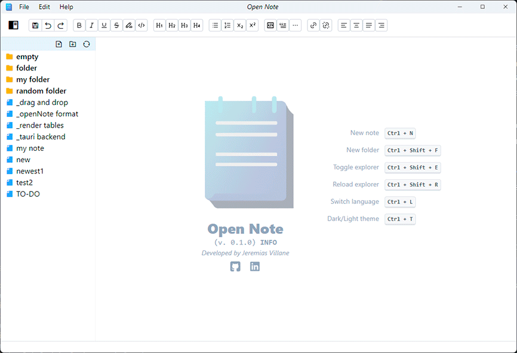

<div align="center">


# Open Note


<a href="https://github.com/jeremiasvillane/open-note/releases"></a>
[](https://github.com/jeremiasvillane/open-note/blob/main/LICENSE)
[](https://app.fossa.com/projects/git%2Bgithub.com%2FJeremiasVillane%2Fopen-note?ref=badge_shield)
[](https://github.com/prettier/prettier)


### Tauri + React + Typescript

<a href="https://tauri.app/" target="_blank" rel="noopener noreferrer"></a>&nbsp; &nbsp; &nbsp;<a href="https://react.dev" target="_blank" rel="noopener noreferrer"></a>&nbsp; &nbsp; &nbsp;<a href="https://www.typescriptlang.org/" target="_blank" rel="noopener noreferrer"></a>

</div>

---

A simple desktop application for taking rich text notes, built with [Tauri](https://tauri.app/) and [React](https://react.dev/), and written in [Rust](https://www.rust-lang.org/) and [TypeScript](https://www.typescriptlang.org/).

<div align="center"></div>

## Key Features

- Create, edit and delete notes/folders.
- Rich text editor powered by [TipTap](https://tiptap.dev/).
- Organize notes into folders and subfolders.
- Export notes in pdf format.
- Multilingual (currently English and Spanish).
- Light/dark theme.
- Status bar showing characters, letters, word and line count, and system messages.
- Global hotkeys to control the main functions via keyboard.
- Resizable panel for exploring the file system.
- Use of Tauri commands (written in [Rust](https://www.rust-lang.org/)) to interact with the OS file system.
- Use of Tauri multiwindow functionality to implement custom modals.
- Use of Tauri events to pass information between windows.

## Project Roadmap

- [x] Export notes in pdf format.
- [ ] Drag & Drop notes in folders.
- [ ] Insert images.
- [ ] Code highlighting.
- [ ] Automatic updates.
- [ ] Cloud sync.
- [ ] Note encryption.

## Download

Go to [releases page](https://github.com/JeremiasVillane/open-note/releases).

## Techstack

- [Tauri](https://tauri.app/): a toolkit to build cross-platform apps.
- [React](https://react.dev/) with [Vite](https://github.com/vitejs/vite).
- [Mantine](https://mantine.dev/) for the app layout.
- [TipTap](https://tiptap.dev/) for the rich text editor.
- [Zustand](https://docs.pmnd.rs/zustand/getting-started/introduction) for state management.
- [Tailwind CSS](https://tailwindcss.com/) for the app styling.
- [react-i18next](https://react.i18next.com/): a powerful internationalization framework based on <strong>i18next</strong>.
- [TypeScript](https://www.typescriptlang.org/) for type safety.
- [Rust](https://www.rust-lang.org/) for the base infrastructure of the app.

## How to run or build from source

### Step 1: Clone the project repository to your computer

- Open a terminal and run the following command to clone the project from GitHub to your computer:

```
git clone https://github.com/JeremiasVillane/open-note.git
```

### Step 2: Install the dependencies

- Open a terminal and navigate to the Open Note project directory.
- Use npm to install the dependencies:

```
cd open-note
npm install
```

### Step 3: Install Tauri

- Visit the [https://tauri.app/v1/guides/getting-started/prerequisites/](https://tauri.app/v1/guides/getting-started/prerequisites/) page to find Tauri installation instructions.

### Step 4: Run or build

- Navigate to the Open Note project directory.
- Use npm to run in dev mode:

```
npm run tauri dev
```

- Or build from source:

```
npm run tauri build
```

## License

Distributed under the [**MIT License**](LICENSE).

[](https://app.fossa.com/projects/git%2Bgithub.com%2FJeremiasVillane%2Fopen-note?ref=badge_large)

## Contact me

- [LinkedIn](https://snppr.vercel.app/2Vt7W2xMe)
